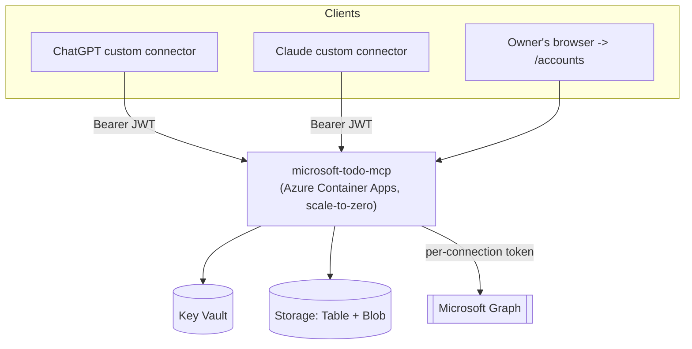

# microsoft-todo-mcp

A remote [Model Context Protocol](https://modelcontextprotocol.io) server
for Microsoft To Do, deployable on Azure and usable as a custom connector
in both **ChatGPT** and **Claude**. Multi-account (personal + work
Microsoft accounts), multi-profile (`/mcp/personal`, `/mcp/work`, or any
custom alias), single-owner administration.

## Architecture at a glance



Full details: [`docs/architecture.md`](docs/architecture.md).

## Why this exists

Microsoft To Do has no first-party remote MCP connector. This project lets
you talk to your Microsoft To Do lists from ChatGPT or Claude, across
however many personal/work Microsoft accounts you have, from a small
self-hosted deployment you fully control (your own Azure subscription, your
own OAuth authorization server, your own encrypted token storage).

## Feature summary

- **MCP tools**: full read/write coverage of task lists, tasks, and
  checklist items, plus account/profile discovery tools — see the tool
  list in [`src/tools/`](src/tools/).
- **Multi-account routing** that never guesses which Microsoft account a
  tool call should hit — see [`docs/multi-account.md`](docs/multi-account.md).
- **Two independent OAuth systems**, documented in
  [`docs/oauth.md`](docs/oauth.md): this server as an OAuth 2.1
  authorization server toward ChatGPT/Claude, and this server as an OAuth
  client toward Microsoft Entra ID/Graph.
- **Encrypted token storage**: AES-256-GCM MSAL token caches in Blob
  Storage, hashed OAuth codes/refresh tokens in Table Storage, secrets in
  Key Vault, all accessed via a least-privilege user-assigned managed
  identity — no client secrets or connection strings in the running
  production process.
- **Owner-only admin UI** at `/accounts` for connecting accounts, binding
  profiles, reauthorizing, revoking, and deleting connections.
- **Azure Container Apps, consumption plan, scale-to-zero** — near-zero
  idle cost; see the cost estimate in
  [`docs/azure-deployment.md`](docs/azure-deployment.md).

## Quick start (local development)

```bash
npm install
cp .env.example .env   # fill in real values — see docs/azure-deployment.md
npm run dev
```

`npm run dev` starts the server with `tsx watch`. You'll need a reachable
Storage account (Azurite works for local dev) and Key Vault (or adapt
`src/config/secrets.ts` for local secret sources) before OAuth flows will
actually work end-to-end — see [`docs/operations.md`](docs/operations.md).

## Deploying to Azure

```powershell
./scripts/login.ps1
./scripts/validate-environment.ps1
$region = ./scripts/select-region.ps1
./scripts/provision.ps1 -ResourceGroupName rg-microsoft-todo-mcp -Location $region -ResourceSuffix prod01 `
    -AzureClientId <graph-app-client-id> -AzureTenantId <tenant-id> `
    -PublicBaseUrl https://todo.h-aa.dk -BudgetNotificationEmail you@example.com
./scripts/deploy.ps1 -ResourceGroupName rg-microsoft-todo-mcp -ContainerAppName todomcp-app-prod01 `
    -Image ghcr.io/<you>/microsoft-todo-mcp:sha-abc123 -Build
./scripts/configure-domain.ps1 -ResourceGroupName rg-microsoft-todo-mcp `
    -ContainerAppEnvironmentName todomcp-env-prod01 -ContainerAppName todomcp-app-prod01 `
    -DomainName todo.h-aa.dk -Location $region
```

Full walkthrough: [`docs/azure-deployment.md`](docs/azure-deployment.md).
DNS specifics: [`docs/dns.md`](docs/dns.md).

## Connecting ChatGPT / Claude

1. Connect at least one Microsoft account and bind a profile from
   `/accounts` — [`docs/multi-account.md`](docs/multi-account.md).
2. Add a custom connector pointing at `/mcp/personal`, `/mcp/work`, or
   `/mcp` (universal) — [`docs/chatgpt-setup.md`](docs/chatgpt-setup.md) /
   [`docs/claude-setup.md`](docs/claude-setup.md).

## Security model

Summarized in [`docs/security.md`](docs/security.md); vulnerability
reporting in [`SECURITY.md`](SECURITY.md).

## Cost estimate

Roughly **10–25 DKK/month** depending on whether Log Analytics is enabled
— see the itemized breakdown in
[`docs/azure-deployment.md`](docs/azure-deployment.md#cost-estimate-approximate-westnorth-europe-pricing-2026).

## Teardown

```powershell
az group delete --name rg-microsoft-todo-mcp --yes --no-wait
```

## Project layout

```
src/            Server source (mcp, graph, oauth, storage, crypto, tools, admin, http)
infra/          Bicep: Container Apps (consumption, scale-to-zero), Key Vault, Storage, RBAC, budget
scripts/        PowerShell 7 provisioning/deploy/ops scripts
docs/           Architecture, deployment, DNS, OAuth, security, connector setup, operations
.github/        CI, CodeQL, secret scanning, OIDC-based deploy workflow
tests/          Vitest unit tests + Playwright OAuth flow tests
```

## License

[MIT](LICENSE).
