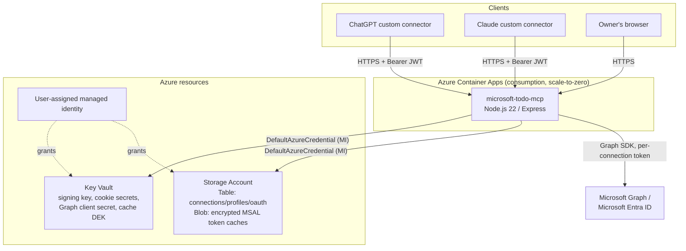

# Architecture

## Overview

`microsoft-todo-mcp` is a single Node.js/TypeScript service, deployed as one
Azure Container Apps (consumption plan, scale-to-zero) application, that:

1. Exposes a **remote MCP server** (Streamable HTTP transport) at `/mcp`,
   `/mcp/personal`, `/mcp/work`, and any other bound `/mcp/{alias}` route.
2. Acts as an **OAuth 2.1 authorization server** toward MCP clients
   (ChatGPT, Claude) — see `docs/oauth.md`.
3. Acts as an **OAuth client** toward Microsoft Entra ID/Graph to read and
   write Microsoft To Do data on behalf of one or more connected Microsoft
   accounts — also `docs/oauth.md`.
4. Serves a small server-rendered **admin page** at `/accounts` for
   connecting/managing Microsoft accounts and profile bindings.



## Request flow: an MCP tool call

1. ChatGPT/Claude sends `POST /mcp/personal` with `Authorization: Bearer
   <mcp-access-token>`.
2. `src/oauth/requireBearer.ts` verifies the JWT (issuer, audience,
   signature via the ES256 key from Key Vault) and attaches
   `req.mcpAuth`.
3. `src/profiles/router.ts` resolves `personal` -> a bound `connectionId`
   via `src/storage/profilesRepo.ts`, builds a fresh `McpServer` +
   `StreamableHTTPServerTransport`, and registers all tools
   (`src/tools/registerAll.ts`) with that connection pre-bound in the
   `ToolContext`.
4. The tool handler (e.g. `create_task`) resolves the Graph client for that
   connection (`src/graph/client.ts`), which pulls a fresh access token via
   MSAL's silent-refresh flow against the connection's encrypted, per-blob
   token cache (`src/graph/upstreamOAuth.ts` + `src/crypto/`).
5. The Graph call is made with pagination/throttling handling
   (`src/graph/pagination.ts`), mapped into a small typed shape
   (`src/graph/todoApi.ts`), and returned as structured tool output. Errors
   are converted into a small, LLM-readable error payload
   (`src/tools/errors.ts`) rather than raw stack traces.

## Why Azure Table/Blob Storage, not SQL

- The data model is small, denormalized, and access-pattern-driven (lookup
  by connection id, by alias, by hashed code/token) — a good fit for
  Table Storage's partition/row-key model without needing relational
  joins.
- Table Storage + Blob Storage together cost close to nothing at this
  traffic level (a handful of requests per day), fitting the ~25 DKK/month
  budget target (see `docs/azure-deployment.md`).
- No connection pooling, no SQL server to keep warm — matters for a
  scale-to-zero Container App that may cold-start on the first request in
  a while.

## Why Container Apps (consumption, scale-to-zero) over Functions/App Service

- The MCP Streamable HTTP transport benefits from a long-lived Node
  process holding an Express app, rather than a stateless
  function-per-invocation model.
- Consumption-plan Container Apps scale to zero when idle (no requests =
  no cost beyond storage/Key Vault), which matches a single-owner,
  low-traffic deployment.
- Native support for custom domains + managed TLS certificates without an
  App Gateway/Front Door in front.

## Multi-account, multi-profile model

See `docs/multi-account.md` for the full model. In short: a **connection**
is one authenticated Microsoft account; a **profile** is a named, URL-safe
alias bound to exactly one connection. `/mcp/{alias}` is bound; the bare
`/mcp` endpoint is deliberately *not* bound to anything, so every tool call
through it must pass an explicit `connection_id` — the server never guesses
which Microsoft account an ambiguous request should hit.

## Security model summary

See `docs/security.md` and `SECURITY.md` for the full picture:

- Two independent OAuth systems (this server as AS, this server as Graph
  client) — see `docs/oauth.md`.
- MSAL token caches encrypted at rest (AES-256-GCM) with a Key-Vault-held
  key, bound via AAD to the connection id.
- OAuth authorization codes and refresh tokens stored **hashed**
  (SHA-256), never as recoverable plaintext.
- Owner-only admin page, gated on a configurable stable identity claim
  (not email), with CSRF protection, security headers (Helmet CSP), and
  rate limiting.
- Structured logs that never include task content, full email addresses,
  tokens, codes, cookies, or raw Graph responses (`src/logging/logger.ts`
  redaction list).

## Cost estimate

See `docs/azure-deployment.md` for the itemized ~25 DKK/month estimate and
the budget alert wired into `infra/modules/budget.bicep`.

## Teardown

```powershell
az group delete --name <resource-group-name> --yes --no-wait
```

This removes the Container Apps environment/app, Key Vault (soft-deleted,
purge separately if needed — see `docs/operations.md`), Storage Account,
managed identity, and budget alert in one step.
