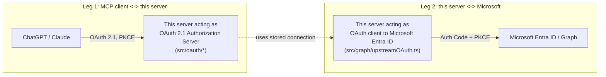

# OAuth model

This project involves **two separate OAuth systems**. Keeping them mentally
separate is the single most important thing for understanding (and safely
extending) the security-sensitive code in `src/oauth/` and `src/graph/`.

## Leg 1 — this server as an OAuth 2.1 Authorization Server

ChatGPT and Claude, when used as MCP clients, need to obtain a bearer token
scoped to **this** server (the "resource") before they can call `/mcp`. This
server implements that authorization server role in `src/oauth/`:

| Concern | File | Notes |
|---|---|---|
| Protected Resource Metadata (RFC 9728) | `src/oauth/wellKnown.ts`, `metadata.ts` | `/.well-known/oauth-protected-resource` |
| Authorization Server Metadata (RFC 8414) / OIDC-discovery-shaped alias | `src/oauth/wellKnown.ts`, `metadata.ts` | `/.well-known/oauth-authorization-server`, `/.well-known/openid-configuration` |
| Dynamic Client Registration (RFC 7591) | `src/oauth/register.ts` | `POST /oauth/register` |
| Authorization endpoint | `src/oauth/authorize.ts` | `GET /oauth/authorize`, one-click owner consent |
| Token endpoint | `src/oauth/token.ts` | `authorization_code` + `refresh_token` grants |
| Revocation (RFC 7009) | `src/oauth/revoke.ts` | `POST /oauth/revoke` |
| Access token format | `src/oauth/jwt.ts` | ES256 JWT, signed with a Key-Vault-held key |
| PKCE verification | `src/oauth/pkce.ts` | S256 only, mandatory |
| Bearer enforcement on `/mcp*` | `src/oauth/requireBearer.ts` | RFC 6750-style `WWW-Authenticate` challenge |

### Security properties implemented

- **PKCE S256 required** on every authorization_code exchange — there is no
  code path that accepts a plain or missing `code_challenge_method`.
- **Exact redirect_uri matching** against the client's registered URIs — no
  prefix/suffix/wildcard matching, and a mismatch fails closed with a JSON
  error rather than redirecting (to avoid open-redirect-adjacent behavior).
- **`resource` parameter + audience validation** — issued JWTs carry `aud`
  set to the resource, and `/mcp*` verifies both `iss` and `aud` on every
  request (`src/oauth/jwt.ts` + `requireBearer.ts`).
- **Issuer validation** — `MCP_OAUTH_ISSUER` is checked on every token
  verification.
- **State validation** — the authorization endpoint requires `state` and
  echoes it back verbatim on the redirect; the client is responsible for
  matching it against what it sent (standard OAuth behavior — we don't try
  to second-guess the client's own CSRF protection for its half of the flow).
- **One-time authorization codes** — `src/storage/oauthRepo.ts`
  (`OAuthCodesRepo.consume`) marks a code `consumed` on first use; a second
  attempt (replay) is rejected as `invalid_grant`, not treated as "unknown."
- **Refresh token rotation + replay detection** — every refresh both issues
  a new refresh token and invalidates the old one. If an already-used
  refresh token is presented again, the whole rotation chain descending
  from it is revoked (`OAuthTokensRepo.revokeChainFrom`), on the assumption
  that reuse means the token leaked.
- **Short-lived access tokens** (`MCP_OAUTH_ACCESS_TOKEN_TTL_SECONDS`,
  default 600s) so a leaked access token has a small blast radius.

### Client registration: Dynamic Client Registration, with pre-registration as documented fallback

Three approaches exist for how an MCP client (ChatGPT, Claude) gets a
`client_id` recognized by this authorization server:

1. **Dynamic Client Registration (DCR, RFC 7591)** — the client `POST`s its
   metadata (name, redirect URIs) to `/oauth/register` and receives a
   `client_id` back, with no human involved. **This is what this project
   implements as the primary path** (`src/oauth/register.ts`), because:
   - It requires no manual step per-connector, which matters since this is
     a single-owner deployment adding both a ChatGPT custom connector and a
     Claude custom connector.
   - Both ChatGPT's and Claude's documented custom-connector flows are able
     to perform DCR against a server that advertises a
     `registration_endpoint` in its Authorization Server Metadata, which
     this server does.
2. **Client ID Metadata Documents (CIMD)** — an emerging alternative where
   the `client_id` itself is a URL that resolves to a metadata document,
   avoiding a registration round-trip. As of this writing it is not
   uniformly supported across MCP clients; this project does not implement
   it, but the authorization endpoint's client lookup
   (`OAuthClientsRepo.get`) is isolated enough that adding CIMD support
   later (resolving unknown `client_id`s that look like URLs, rather than
   only looking them up in Table Storage) is a contained change.
3. **Pre-registered / static clients** — an admin manually inserts a row
   into the `oauthclients` table (e.g. via a one-off script or directly via
   Table Storage tooling) with a fixed `client_id` and redirect URI. Useful
   as a fallback if a given MCP client does not perform DCR, or if you want
   a stable `client_id` to reference in documentation/screenshots. This
   path is supported by the data model (`registrationMethod:
   "pre_registered"` in `src/storage/types.ts`) but there is no built-in
   admin-UI form for it yet — see the TODO in `docs/operations.md`.

**Assumption flagged for the reader:** the exact current (2026) behavior of
ChatGPT's and Claude's custom-connector onboarding UIs — whether they
always perform DCR automatically, whether they cache a `client_id` across
reconnects, and how they surface admin-consent-required errors — could not
be verified against live product behavior at the time this was written.
Verify against the current ChatGPT and Claude connector documentation
before relying on any of the above in production, and see
`docs/chatgpt-setup.md` / `docs/claude-setup.md` for the step-by-step setup
this project assumes.

### Owner authentication for `/oauth/authorize`

Because this deployment has exactly one resource owner, the authorization
endpoint does not implement a general-purpose login system. Instead:

- `src/admin/ownerLogin.ts` runs a minimal (openid + profile scope only, no
  Graph scopes) Microsoft sign-in used purely to prove "this browser
  belongs to the deployment owner," gated by comparing a configured claim
  (`ADMIN_OWNER_CLAIM_NAME`/`ADMIN_OWNER_CLAIM_VALUE`, e.g. `oid`) against
  the signed-in account.
- Once that session cookie exists, `/oauth/authorize` shows a one-click
  "Allow" consent screen (CSRF-protected) rather than a multi-user consent
  system, since there is only ever one possible answer to "which user is
  granting consent."

This is intentionally decoupled from Leg 2 below — logging in as the owner
does not itself connect a Microsoft To Do account.

## Leg 2 — this server as an OAuth client to Microsoft Entra ID

`src/graph/upstreamOAuth.ts` and `src/graph/msalClient.ts` implement the
*client* side of Authorization Code + PKCE (S256) against Microsoft Entra
ID, used to connect (or reconnect) a Microsoft To Do account:

- **Authority**: always `https://login.microsoftonline.com/common`, which
  is required for the app registration's sign-in audience
  `AzureADandPersonalMicrosoftAccount` (work/school accounts **and**
  personal Microsoft accounts).
- **Scopes**: `Tasks.ReadWrite User.Read openid profile offline_access`.
- **PKCE S256** generated fresh per sign-in (`generatePkce()`).
- **State** generated and checked per sign-in.
- **Exact redirect URI**: `${PUBLIC_BASE_URL}/oauth/microsoft/callback`,
  configured once on the Entra app registration.
- **Admin-consent-required handling**: `isAdminConsentError()` recognizes
  `AADSTS65001`/`AADSTS90094`/`consent_required` and
  `buildAdminConsentError()` returns a message that includes the tenant id
  and a ready-to-use admin consent URL
  (`https://login.microsoftonline.com/{tenant}/adminconsent?client_id=...`),
  surfaced both in the admin UI and in any MCP tool call that hits it
  mid-session (`src/tools/errors.ts`).
- **Token cache**: MSAL's serialized token cache is encrypted
  (AES-256-GCM, `src/crypto/tokenCacheCipher.ts`) and persisted per
  connection via a `ICachePlugin` backed by Azure Blob Storage
  (`src/storage/connectionsRepo.ts`).

## Why not just one OAuth system?

Collapsing these into a single flow would require this server to either (a)
pass through Microsoft's own tokens directly to ChatGPT/Claude — which
would give the MCP client raw Graph-scoped tokens it has no business
holding, and would break the moment more than one Microsoft account/profile
is involved — or (b) have ChatGPT/Claude talk to Microsoft Entra ID
directly, which would remove this server's ability to enforce
profile-to-connection binding, do multi-account routing, or scope what an
MCP client can request (`resource`/`scope` are validated against *this*
server's audience, not Microsoft's).
